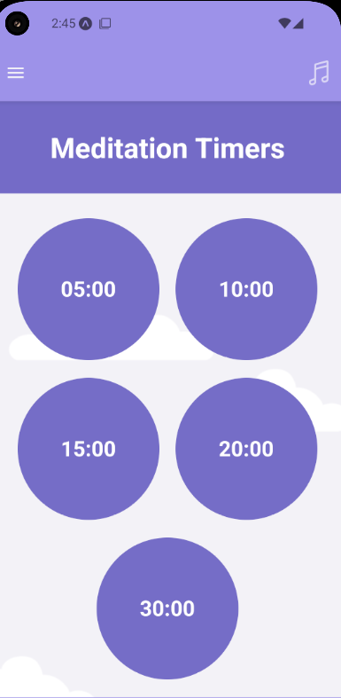
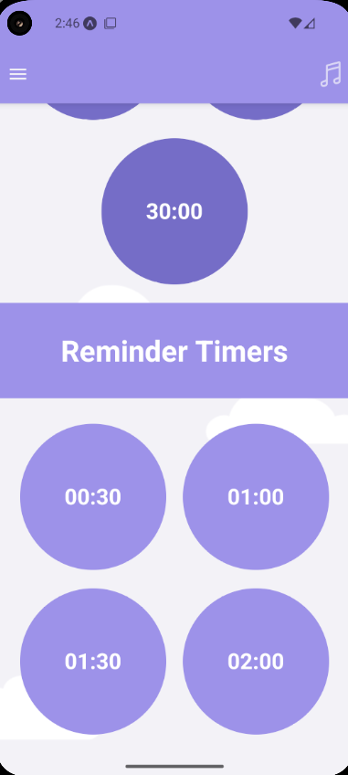
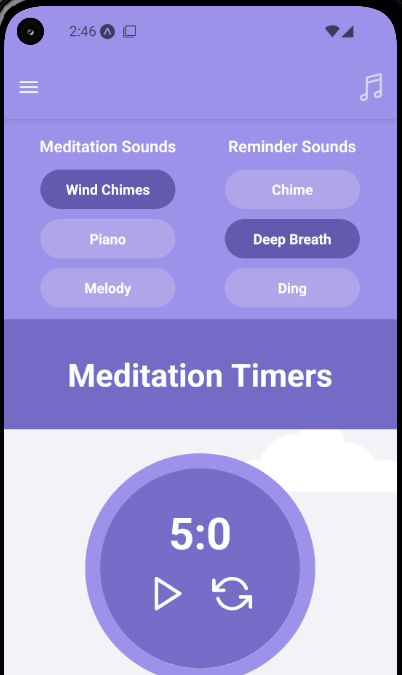

# Minding Meditator Mobile

Minding Meditator Mobile is the mobile version for Minding Meditator, a free meditation assistant. Don't lose focus with Minding Meditator, using the app's reminders, to ensure you always bring yourself back to the present moment. 

## Features
#### Simple To use:
Minding Meditator Mobile is very easy to use, simply select a sound for your meditation and reminder timers, and start them as you begin your meditation.

#### No Extra Bells and Whistles:
Optimised so it runs on many smart phones, you don't need a powerful or the latest smart phone to use it!

## Roadmap

- Main core features described above.

- Add notifications so users an use the timers whilst the screen is closed.

## Tech Stack

**Client:** React Native and Expo

## License

[MIT](https://choosealicense.com/licenses/mit/)

